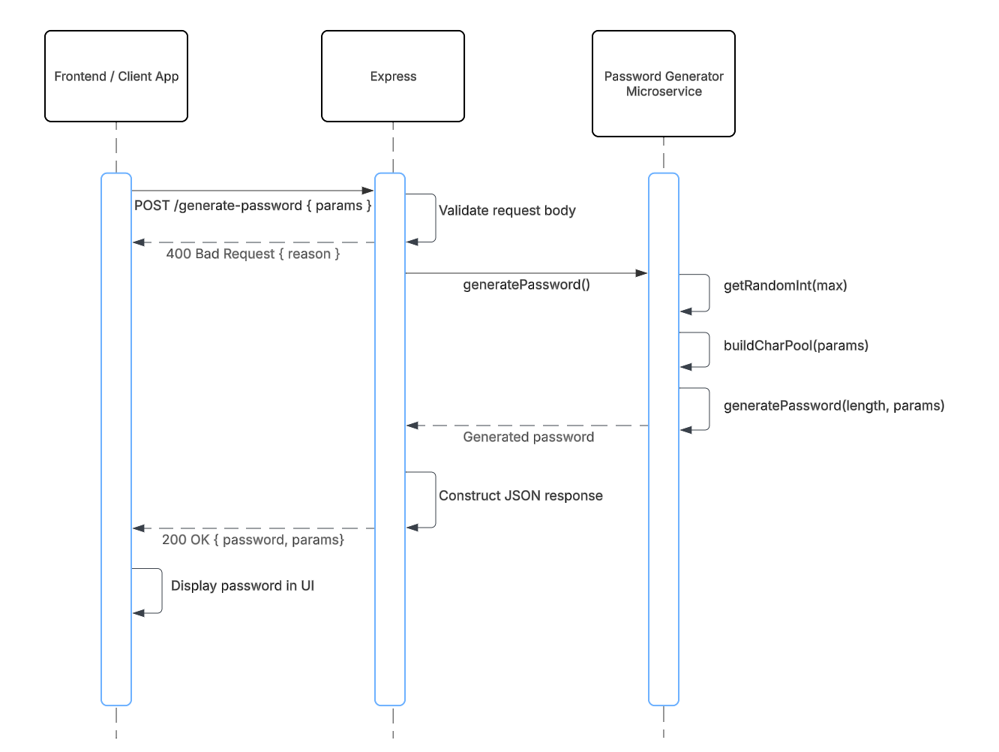

# Password Generator Microservice

## Overview

This microservice is a **REST API built with Express.js** that generates secure, customizable passwords. Clients can request passwords by specifying rules such as length and character types (uppercase, lowercase, numbers, symbols). The service responds with a randomly generated password that meets the requested criteria.

It is designed to be used by other web applications that need secure password generation.

---

## Features

* Generate secure random passwords
* Customize password length
* Include/exclude:

  * Uppercase letters
  * Lowercase letters
  * Numbers
  * Symbols
* RESTful JSON API
* CORS enabled for frontend integration

---

## Requesting Data from the Microservice

To request a password, send a **POST request** to the following endpoint:

```http
POST /generate-password
```

### URL (local development)

```http
http://localhost:3000/generate-password
```

### Required Request Format

Send a JSON body with the following structure:

| Field | Type | Required | Description |
|--------|------|-----------|-------------|
| length | number | Yes | Length of the password (minimum 4) |
| includeUppercase | boolean | No | Include uppercase letters |
| includeLowercase | boolean | No | Include lowercase letters |
| includeNumbers | boolean | No | Include numbers |
| includeSymbols | boolean | No | Include symbols |

### Example Request (JavaScript)

```javascript
const response = await fetch("http://localhost:3000/generate-password", {
  method: "POST",
  headers: {
    "Content-Type": "application/json"
  },
  body: JSON.stringify({
    length: 12,
    includeUppercase: true,
    includeLowercase: true,
    includeNumbers: true,
    includeSymbols: false
  })
});
```

#### Explanation of the JavaScript Example

This example sends a **POST request** to the password generator API using JavaScript's `fetch()` function.

**Request breakdown:**

* `method: "POST"` tells the server that data is being sent to create or generate something.
* `headers: { "Content-Type": "application/json" }` informs the server that the request body is formatted as JSON.
* `body: JSON.stringify(...)` converts the JavaScript object into JSON so it can be sent to the API.

**Password criteria in this example:**

```json
{
  "length": 12,
  "includeUppercase": true,
  "includeLowercase": true,
  "includeNumbers": true,
  "includeSymbols": false
}
```

This configuration requests:

* A password that is **12 characters long**
* **Uppercase letters included** (A–Z)
* **Lowercase letters included** (a–z)
* **Numbers included** (0–9)
* **Symbols excluded** (such as `!`, `@`, `#`, `$`)

Because symbols are disabled, the generated password will contain only letters and numbers.

Example possible output:

```text
A9kLm2QwErTy
```

The exact password will be different each time because passwords are generated randomly.

### Example Request (cURL)

```bash
curl -X POST http://localhost:3000/generate-password \
  -H "Content-Type: application/json" \
  -d '{
    "length": 12,
    "includeUppercase": true,
    "includeLowercase": true,
    "includeNumbers": true,
    "includeSymbols": false
  }'
```

#### Explanation of the cURL Example

This example performs the same request as the JavaScript example but from the command line using **cURL**.

**Command breakdown:**

* `curl -X POST` sends a POST request.
* `-H "Content-Type: application/json"` sets the request content type to JSON.
* `-d '{...}'` sends the JSON body containing the password rules.

This is useful for:

* Quickly testing the API in a terminal
* Debugging backend behavior
* Verifying the server works without needing a frontend

If the microservice is running correctly, the server will respond with a generated password in JSON format.

---

## Receiving Data from the Microservice

The microservice responds with a **JSON object** containing:

| Field | Type | Description |
|--------|------|-------------|
| password | string | The generated password |
| length | number | Length of the password |
| criteria | object | The rules used to generate the password |

### Example Response

```json
{
  "password": "A9kLm2QwErTy",
  "length": 12,
  "criteria": {
    "includeUppercase": true,
    "includeLowercase": true,
    "includeNumbers": true,
    "includeSymbols": false
  }
}
```

#### Explanation of the Response Example

The API returns a JSON object containing information about the generated password.

**Response breakdown:**

### `password`

```json
"password": "A9kLm2QwErTy"
```

This is the newly generated password. The password is randomly created based on the requested rules.

In this example:

* It contains uppercase letters
* It contains lowercase letters
* It contains numbers
* It does **not** contain symbols

Because password generation is random, this value will be different every time a request is made.

### `length`

```json
"length": 12
```

This confirms the final length of the generated password.

This is useful for:

* Validation on the client side
* Double-checking that the API returned the requested length
* Debugging request issues

### `criteria`

```json
"criteria": {
  "includeUppercase": true,
  "includeLowercase": true,
  "includeNumbers": true,
  "includeSymbols": false
}
```

This object returns the rules used during password generation.

Including the criteria in the response helps developers:

* Verify the password settings used
* Debug frontend/backend communication
* Confirm the API received the intended configuration

For example, if a frontend accidentally disables numbers, the returned `criteria` object will clearly show the issue.

### Example Response Handling (JavaScript)

```javascript
const data = await response.json();

console.log("Generated Password:", data.password);
console.log("Length:", data.length);
console.log("Criteria Used:", data.criteria);
```

#### Explanation of Response Handling

This code processes the JSON returned by the API.

**Line-by-line explanation:**

```javascript
const data = await response.json();
```

Converts the server response into a JavaScript object.

```javascript
console.log("Generated Password:", data.password);
```

Prints the generated password.

```javascript
console.log("Length:", data.length);
```

Prints the password length returned by the server.

```javascript
console.log("Criteria Used:", data.criteria);
```

Displays the rules that were used to generate the password.

Example console output:

```text
Generated Password: A9kLm2QwErTy
Length: 12
Criteria Used: {
  includeUppercase: true,
  includeLowercase: true,
  includeNumbers: true,
  includeSymbols: false
}
```

This is useful for frontend applications that need to immediately display the generated password to users.

---

## System Architecture (UML Sequence Diagram)

The following diagram shows how a client interacts with the microservice to generate and receive a password:



---

## Demo Video

A full demonstration of how the Password Generator Microservice works, including example requests, responses, and frontend integration, is attached in an mp4 video.

---

# How to Run the Microservice

### 1. Install dependencies

```bash
npm install
```

This installs all required packages listed in `package.json`.

### 2. Start the server

```bash
npm start
```

This launches the Express server.

### 3. API will run at

```http
http://localhost:3000/
```

You can access the password endpoint from this base URL.

### 4. The example frontend runs at

```http
http://localhost:3000/example.html
```

This page provides a simple interface for testing password generation in a browser.

### 5. Test the server in terminal

```bash
npm test
```

Runs the microservice tests to verify the API works correctly.
