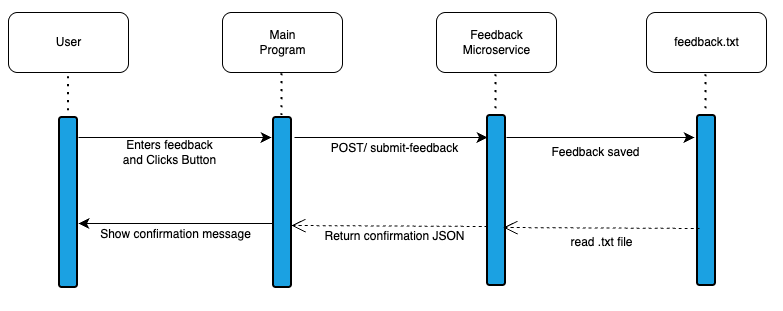

# Feedback Microservice

## Description

The Feedback Microservice is a small REST API that lets another program send user feedback to a server.

A user can type a feedback message into a form. The main program sends that message to this microservice as JSON. The microservice saves the feedback to a local `feedback.txt` file and returns a confirmation message.

Example confirmation message:

```text
Thanks for your feedback, this will help us improve this site!
```

The main program is responsible for showing that message to the user.

---

## How to Run

Install NPM:

```bash
npm install
```

Start the microservice:

```bash
npm start
```

The microservice will run locally at:

```text
http://localhost:3002
```

# How to Test

After starting the server, open:

```
[insert your location path here]/feedback-service/test.html
```
to see the API in action.

---

## Endpoint: POST /submit-feedback

This endpoint is used when the main program wants to submit feedback from a user.

## Required Request Parameters

The request body must be JSON and should include:

| Parameter | Type | Required | Description |
|---|---|---|---|
| `feedbackMessage` | string | Yes | The feedback message entered by the user |
| `userId` | number or string | No | The ID of the user submitting feedback. If not included, the user is saved as `anonymous` |

### Example Request Using JavaScript

```javascript
const response = await fetch("http://localhost:3002/submit-feedback", {
  method: "POST",
  headers: {
    "Content-Type": "application/json"
  },
  body: JSON.stringify({
    userId: 1,
    feedbackMessage: "This website is easy to use."
  })
});

const data = await response.json();

console.log(data);
```

### Example Request Body

```json
{
  "userId": 1,
  "feedbackMessage": "This website is easy to use."
}
```

---

## How to Receive Data from the Microservice

After the main program sends a request to `/submit-feedback`, the microservice responds with JSON.

The main program can read the response with:

```javascript
const data = await response.json();
```

The response contains a success value, a confirmation message, and the feedback data that was received.

### Example Response

```json
{
  "success": true,
  "message": "Thanks for your feedback, this will help us improve this site!",
  "feedback": {
    "userId": 1,
    "feedbackMessage": "This website is easy to use.",
    "submittedAt": "2026-05-28T12:00:00.000Z"
  }
}
```

### Response Data

| Field | Type | Description |
|---|---|---|
| `success` | boolean | Shows whether the request worked |
| `message` | string | Confirmation message that can be shown to the user |
| `feedback` | object | The feedback data received by the microservice |
| `feedback.userId` | number or string | The user who submitted the feedback |
| `feedback.feedbackMessage` | string | The feedback text submitted by the user |
| `feedback.submittedAt` | string | The date and time the feedback was submitted |

---

## Error Response

If the feedback message is empty, the microservice returns an error.

### Example Error Request Body

```json
{
  "userId": 1,
  "feedbackMessage": ""
}
```

### Example Error Response

```json
{
  "success": false,
  "error": "Feedback message is required."
}
```

---

# UML Sequence Diagram



---

## Notes

This microservice does not directly display anything on the screen. It only receives feedback, saves it, and sends JSON data back to the main program.

The main program is responsible for showing the confirmation message to the user.

For example, the main program could display:

```javascript
alert(data.message);
```
