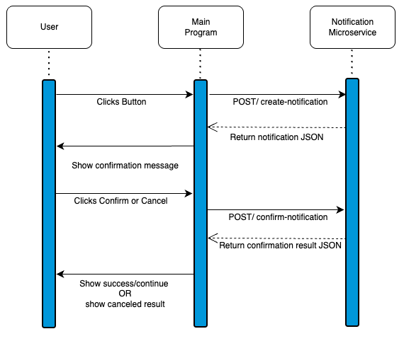

# Notification Microservice

## Overview

The Notification Microservice is a small REST API that helps another program show confirmation messages to a user.

For example, if a user clicks a button like **Delete Item**, the main program can ask this microservice to create a confirmation notification. The microservice will return a message like:

```text
Are you sure you want to delete this item?
```

The main program can then show that message to the user in a popup, alert, modal, or confirmation box.

This microservice also lets the main program send back whether the user clicked **Confirm** or **Cancel**.

---

# How to Run

Install NPM:

```bash
npm install
```

Start the microservice:

```bash
npm start
```

The microservice will run locally at:

```text
http://localhost:3001
```

---

# How to Test

After starting the server, open:

```
[insert your location path here]/notification-service/test.html
```
to see the API in action.

---


# How to REQUEST Data

Send a `POST` request to:

```text
/create-notification
```

This endpoint is used when the main program wants to create a confirmation message.

## Required Request Parameters

The request body must be JSON and should include:

| Parameter    | Type             | Required | Description                               |
| ------------ | ---------------- | -------- | ----------------------------------------- |
| `userId`     | number or string | Yes      | The ID of the user who clicked the button |
| `actionType` | string           | Yes      | The type of action being confirmed        |
| `buttonName` | string           | Yes      | The name of the button the user clicked   |

## Example Request Using JavaScript

```javascript
const response = await fetch("http://localhost:3001/create-notification", {
  method: "POST",
  headers: {
    "Content-Type": "application/json"
  },
  body: JSON.stringify({
    userId: 1,
    actionType: "delete_item",
    buttonName: "Delete Item"
  })
});

const data = await response.json();

console.log(data);
```

## Example Request Body

```json
{
  "userId": 1,
  "actionType": "delete_item",
  "buttonName": "Delete Item"
}
```

---

# How to RECEIVE Data from the Microservice

After the main program sends a request to `/create-notification`, the microservice sends back a JSON response.

The main program receives this response using:

```javascript
const data = await response.json();
```

The response contains the confirmation message and information about the notification.

## Example Response from `/create-notification`

```json
{
  "success": true,
  "notificationId": 1,
  "userId": 1,
  "actionType": "delete_item",
  "buttonName": "Delete Item",
  "message": "Are you sure you want to delete this item?",
  "requiresConfirmation": true,
  "confirmText": "Confirm",
  "cancelText": "Cancel",
  "status": "pending"
}
```

## Response Data

| Field                  | Type             | Description                               |
| ---------------------- | ---------------- | ----------------------------------------- |
| `success`              | boolean          | Shows whether the request worked          |
| `notificationId`       | number           | The ID of the created notification        |
| `userId`               | number or string | The user connected to the notification    |
| `actionType`           | string           | The type of action being confirmed        |
| `buttonName`           | string           | The button the user clicked               |
| `message`              | string           | The confirmation message to show the user |
| `requiresConfirmation` | boolean          | Shows whether the user needs to confirm   |
| `confirmText`          | string           | Text for the confirm button               |
| `cancelText`           | string           | Text for the cancel button                |
| `status`               | string           | The current status of the notification    |

---

# Confirming or Canceling a Notification

After the main program receives the notification message, it can show the message to the user.

Then, after the user clicks **Confirm** or **Cancel**, the main program can send the result back to the microservice.

Use this endpoint:

```text
/confirm-notification
```

## Required Request Parameters

| Parameter        | Type    | Required | Description                                                |
| ---------------- | ------- | -------- | ---------------------------------------------------------- |
| `notificationId` | number  | Yes      | The ID of the notification being confirmed or canceled     |
| `confirmed`      | boolean | Yes      | `true` if the user confirmed, `false` if the user canceled |

## Example Request Using JavaScript

```javascript
const response = await fetch("http://localhost:3001/confirm-notification", {
  method: "POST",
  headers: {
    "Content-Type": "application/json"
  },
  body: JSON.stringify({
    notificationId: 1,
    confirmed: true
  })
});

const data = await response.json();

console.log(data);
```

## Example Request Body

```json
{
  "notificationId": 1,
  "confirmed": true
}
```

## Example Response from `/confirm-notification`

```json
{
  "success": true,
  "notificationId": 1,
  "confirmed": true,
  "status": "confirmed",
  "message": "The action was confirmed."
}
```

If the user cancels, the request body would be:

```json
{
  "notificationId": 1,
  "confirmed": false
}
```

And the response would look like:

```json
{
  "success": true,
  "notificationId": 1,
  "confirmed": false,
  "status": "canceled",
  "message": "The action was canceled."
}
```

---

# UML Sequence Diagram



---
